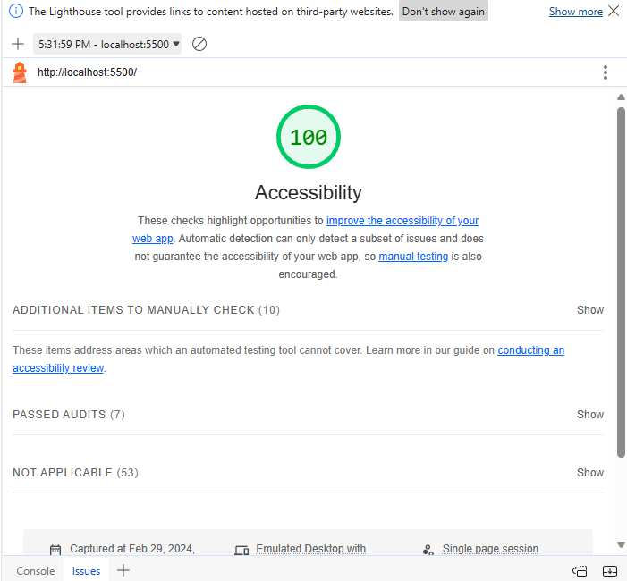

## Lighthouse

## Synopsis

Odd-Duck is a program that allows a user to click their favorite image. It then logs how many times images were shown and how many times they were clicked. A developer may use any number of images and the code will account for this.

## Code Example

This is not a library. Please follow the naming convention for files as provided in the code.

## Motivation

I wanted to pass my class and this assignment was a part of that process.

## Installation

Simply git clone the repository.
